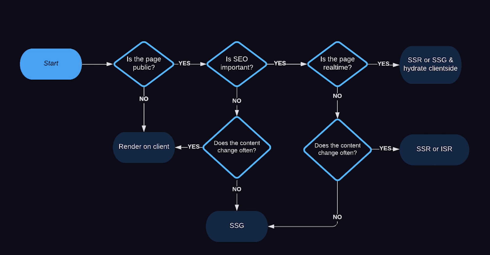

# Intro: NextJS explained

1st lesson from the course <https://fireship.io/courses/nextjs/basics-next-100s/>

## Special Files

- page.tsx: A file used to define the unique Ul of a route. Pages represent the leaf of the route and are needed for the path to be accessible.

- layout.tsx: A file used to define UI that is shared across multiple pages. A layout accepts another layout or a page as its child. You can nest layouts to create nested routes.

- loading.tsx: An optional file used to create loading UI for a specific part of an app. It automatically wraps a page or child layout in a React Suspense Boundary, showing your loading component immediately on the first load and when navigating between sibling routes.

- error.tsx: An optional file used to isolate errors to specific parts of an app, show specific error information, and functionality to attempt to recover from the error. It automatically wraps a page or child layout in a React Error Boundary. Showing your error component whenever an error in a subtree is caught.

- template.ts: An optional file, similar to layouts, but on navigation, a new instance of the component is mounted and the state is not shared. You can use templates for cases where you require this behavior, such as enter/exit animations.

- head.tsx: An optional file used to define the contents of the «head> tag for a given route.

## Route as an API

@see: [./app/src/app/json/route.tsx]

## What to render if…?

but with nextjs its quite simple,

* Server components by default or by `use server`, to render with nodejs session with possible opt-in for caching rendering
* Client Components with `use client`, to render in browser session

And to have better control on things, utilise options as used in: `app/src/app/notes/page.tsx` taken from the doc: <https://nextjs.org/docs/app/api-reference/file-conventions/route-segment-config#fetchcache>

## Data fetching

Nextjs can track `await fetch(…)` and cache them, unless you have custom cache config

So we can fine tune caching on page level and on fetching data level 🎉

## Streaming and Suspense

1. fetch data on the server
2. render component into html on the server
3. server sends html with css/js into the browser
4. browser renders non-interactive page
5. browser loads dynamic clients part and makes page as interactive one

the streaming allows to load page in chunks…

the `React.Suspense` allows to fine tune the loading state, but for NextJS its fine to use 'loading.tsx' to handle this state

## Auth.js or `next-auth`

The solutoin to handle various auth options. Follow instructions of <https://next-auth.js.org/getting-started/example> to get started.

Keep in mind the providers in it, and also the place where you want to keep the data.

## Prisma

* Keeps DB Schmea in sync
* Maintains existing data

For me personally prisma is very bloated and to big and can be replaced with `kysely`.

For platform of choice, if that will happen, it will be `supabase` which already has enough of configuraiton to handle all the parts which prisma does.

In short, I am not interested in this due to already worked with prisma before.
